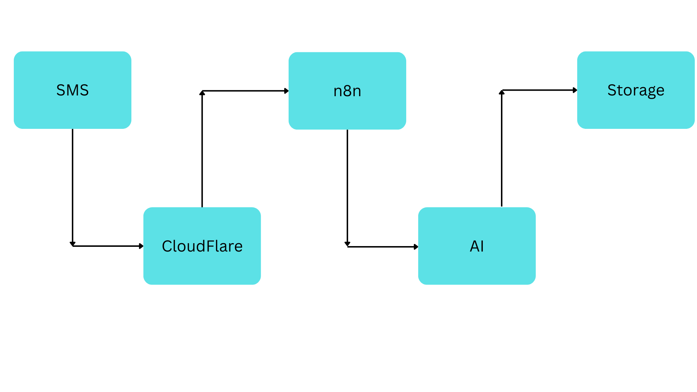
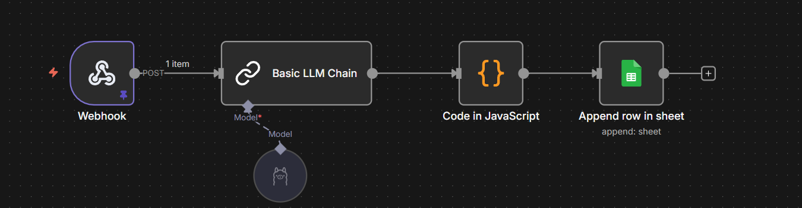
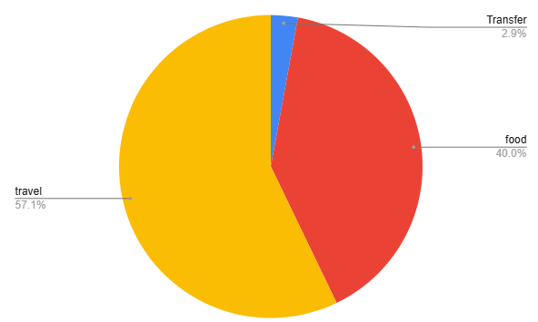

# AI-Powered SMS Budget Automation
## (MacroDroid + n8n + Cloudflare Tunnel)
### Event-driven financial transaction pipeline using Android automation, n8n orchestration, local LLM categorization (Ollama), and secure webhook routing via Cloudflare Tunnel.

## Problem
Most budgeting apps:
- Require broad device permissions
- Lock data into proprietary ecosystems
- Require manual entry, creating friction

## Goal:
- Build a privacy-first, self-hosted budgeting pipeline with full data control.

## Overview
- Captures transaction SMS locally (Android)
- Sends structured payload to a secure webhook
- Uses a local LLM (Ollama – Llama 3.1 8B) for categorization
- Stores transactions in Google Sheets (or PostgreSQL)
- Generates automatic spending breakdown charts

## Architecture

## Tech Stack & Limitations
### Android + MacroDroid
Why local trigger?
- Avoid third-party SMS readers
- Preserve privacy
- Reduce attack surface 

Trade-off:
- Device must remain active
- Battery impact possible

### Cloudflare Tunnel
Why not expose local IP directly?
- Avoid port forwarding
- Avoid exposing home network
- Simplify secure remote access 

Trade-off:
- Free plan creates temporary URLs
- Reliance on external service

### n8n
Why orchestration instead of writing custom server?
- Visual workflow control
- Easier debugging
- Faster iteration
- Clear separation of triggers and processing 

Trade-off:
- Requires 24/7 runtime

## Local LLM (Ollama)
Why local inference instead of OpenAI API?
- Privacy (financial data)
- No per-call cost
- Offline capability 

Trade-off:
- Hardware requirements
- Slightly lower model quality
- Slower inference

## Google Sheets (current version)
Why not PostgreSQL initially?
- Rapid prototyping
- Simpler dashboarding
- Lower setup friction 

Trade-off:
- Limited scalability
- No strict schema enforcement
- Weak indexing

## Overall Limitation
- Requires always-on services
- Limited scalability
- Manual setup complexity
- No enterprise-grade security

## Screenshots

## How It Works
1. SMS received from bank. 
2. MacroDroid triggers HTTP POST request. 
3. Cloudflare Tunnel securely exposes local n8n instance. 
4. n8n processes payload. 
5. LLM extracts and classifies transaction. 
6. Structured data appended to storage. 
7. Dashboard updates automatically.

## Failure & Risk Handling
- What happens if LLM fails? /
LLM failures default to Uncategorized while preserving raw data.
- What if webhook is spammed? /
Webhook abuse mitigated through request validation and token-based authentication.
- How deduplication is handled? (planned) /
The system creates a unique fingerprint for each transaction and checks if it already exists before saving it, so the same SMS cannot be recorded twice.
- How malformed SMS is handled? (planned) /
Malformed SMS stored in raw form with failure flags for later review.

## Future Improvements
- Replace Google Sheets with PostgreSQL.
-Add indexing and transaction deduplication.
- Integrate with Power BI for advanced analytics.
- Implement webhook authentication and request validation.
- Add rule-based pre-classification before LLM.
- Add monthly trend and anomaly detection.

## Improvements Planned
- Power Bi Dashboard / 
- PostgreSQL backend / 
- Add monthly trend charts / 
- Add spending alerts/limit /

## Docs folder reference
/docs
  macrodroid-setup.md ( How to set up macrodroid )
  n8n-workflow.md ( How to set up n8n )
  cloudflare-tunnel.md ( How to get Free cloudflare tunnel )
  storage-schema.md ( How to store data )
