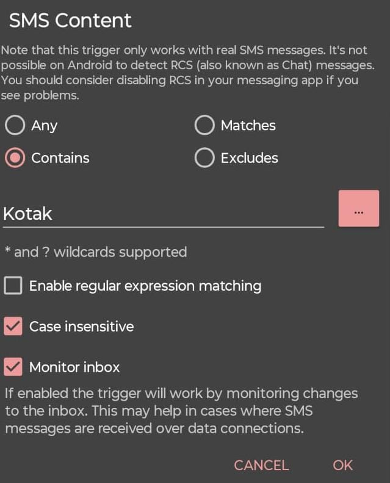
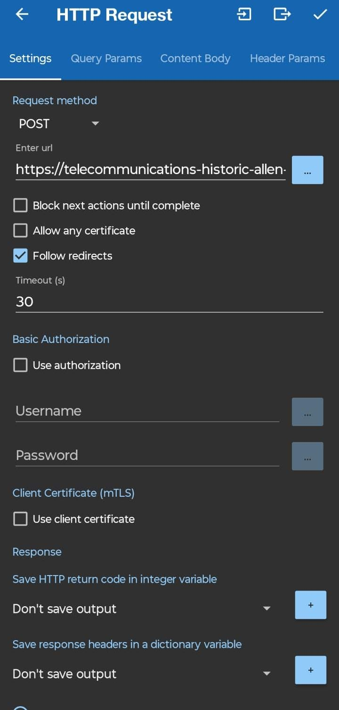

# MacroDroid Setup Guide

## 1. Purpose
This macro:
- Listens for incoming bank SMS messages  
- Extracts relevant message content  
- Sends a structured HTTP POST request to the n8n webhook endpoint  
This enables automated transaction ingestion without granting full SMS access to third-party budgeting applications.


## 2. Macro Configuration
### Trigger
**Type:** SMS Received  
**Configuration:**
- **Sender filter (example):**
  - `VK-KOTAKB`
  - `VM-HDFCBK`
- **Optional content filter:**
  - `credited`
  - `debited`
  - `INR`
  - `UPI`
Filtering reduces unnecessary webhook calls and improves reliability.
```markdown

```
Action
Type: HTTP Request
Configuration:
Method: POST
URL:
https://<your-cloudflare-url>/webhook
Headers:
Content-Type: application/json
(Recommended for security)
Authorization: Bearer <your-secret-token>
Body (JSON):
{
  "sms_body": "[sms_message]",
  "sender": "[sender]",
  "timestamp": "[timestamp]"
}

MacroDroid variables:
[sms_message] → Full SMS content
[sender] → SMS sender ID
[timestamp] → Message received time



3. Android Permissions Required
MacroDroid must be granted:
SMS Read permission
Background execution permission
Disabled battery optimization
(Optional) Contacts permission if filtering by contact name

OEM-Specific Caveats
Some Android vendors aggressively restrict background apps:
MIUI (Xiaomi)
Realme UI
Samsung One UI (Battery Saver modes)
Recommended configuration:
Whitelist MacroDroid from battery optimization
Enable auto-start
Allow background activity
Failure to configure these may result in missed webhook triggers.

4. Testing Procedure
To verify correct setup:
Send a test SMS from a registered bank sender.
Open n8n and check webhook execution logs.
Confirm:
Webhook receives payload
LLM processes the message
Transaction row is appended to storage
Verify dashboard updates correctly.
If execution does not trigger:
Confirm Cloudflare tunnel is active
Validate webhook URL
Re-check Android battery and background restrictions
